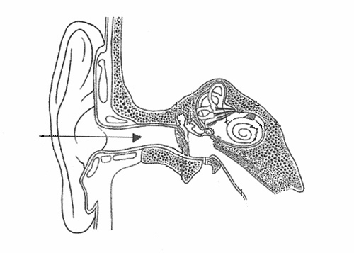

---
defaults:
# _pages
- scope:
path: ""
sidebar:
  nav: "bio"
type: pages
values:
layout: single
author_profile: false
breadcrumbs: false
permalink: /about/
---

This site is dedicated to sharing information about what I do as a musician, composer and researcher. The site is an infinite work-in-progress and perhaps more of an archive than a promotion for myself. I do however use this site, among other things, as a virtual stage posting new recordings and pieces every now and then.

<!-- <a href="about.html">bio</a> |  -->
<!-- <a href="short_bio.html">short bio</a> |  -->
<!-- <a href="swed_bio.html">Swedish bio</a> |  -->
<!-- <a href="short_swed_bio.html">short Swedish bio</a> | -->




	<h4> {{ member.title }} </h4>
	<!-- 
 | updated {{ member.date }} | 
 -->
	
 | updated {{ member.date }} | 

	
 {{ member.text }} 

	
 {{ member.text2 }} 

	
 {{ member.text3 }} 

	


 {{ page.url }} 

